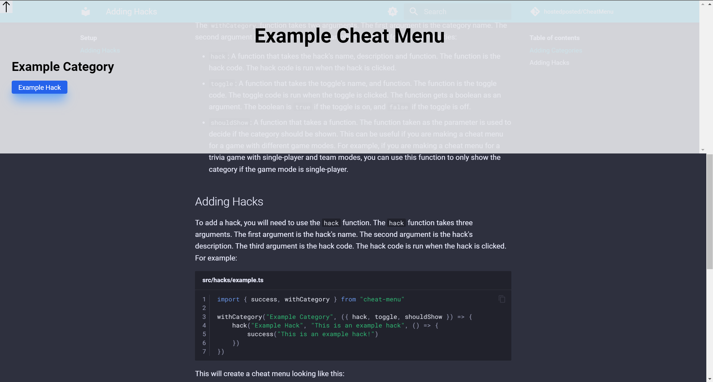
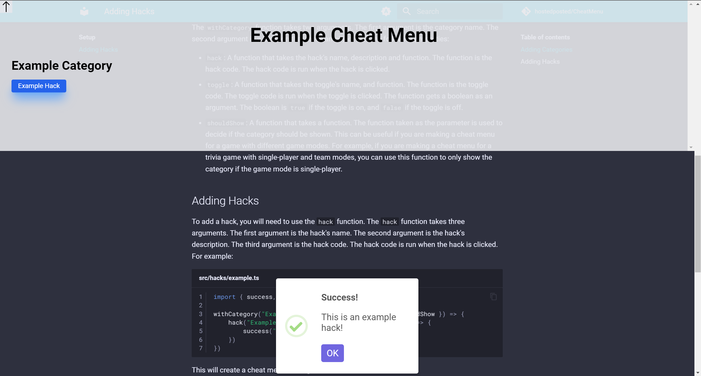
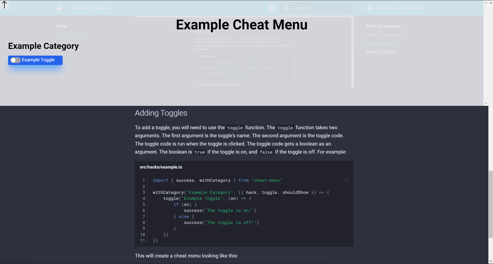
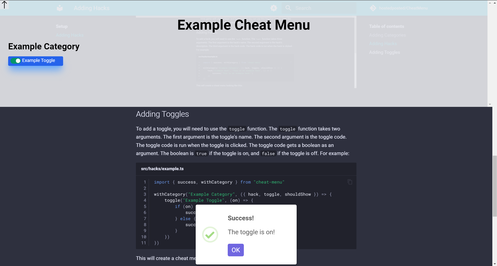

# Adding Hacks

Adding hacks is simple! To start you will need to [add a category](#adding-categories).

## Adding Categories

In the cheat menu directory, there will be a configuration file called ``cheat-menu-config.js``.

It will look something like this:

```js linenums="1" title="cheat-menu-config.js"
/** @type {import("chenu-cli").Config} */
export const config = {
    title: "Example Cheat Menu",
    categories: []
}
```

In the ``categories`` array, you can add categories. A category should be a string. For example:

```js linenums="1" title="cheat-menu-config.js"
/** @type {import("chenu-cli").Config} */
export const config = {
    title: "Example Cheat Menu",
    categories: ["Example Category"]
}
```

Once you have added the category to the configuration file, you need to create a file for the category. Under the ``src`` directory, there should be a ``hacks`` directory. This is the directory where you will have your category code. Create a file with the name of the category. For this example, we will name the file ``example.ts``. The file should look something like this:

```ts linenums="1" title="src/hacks/example.ts"
import { success, withCategory } from "chenu"

withCategory("Example Category", ({ hack, toggle, shouldShow }) => {

})
```

The ``withCategory`` function takes two arguments. The first argument is the category name. The second argument is a function that takes an object with the following properties:

- ``hack``: A function that takes the hack's name, description and function. The function is the hack code. The hack code is run when the hack is clicked.
- ``toggle``: A function that takes the toggle's name, and function. The function is the toggle code. The toggle code is run when the toggle is clicked. The function gets a boolean as an argument. The boolean is ``true`` if the toggle is on, and ``false`` if the toggle is off.
- ``shouldShow``: A function that takes a function. The function taken as the parameter is used to decide if the category should be shown. This can be useful if you are making a cheat menu for a game with different game modes. For example, if you are making a cheat menu for a trivia game with single-player and team modes, you can use this function to only show the category if the game mode is single-player.

## Adding Hacks

To add a hack, you will need to use the ``hack`` function. The ``hack`` function takes three arguments. The first argument is the hack's name. The second argument is the hack's description. The third argument is the hack code. The hack code is run when the hack is clicked. For example:

```ts linenums="1" title="src/hacks/example.ts"
import { success, withCategory } from "chenu"

withCategory("Example Category", ({ hack, toggle, shouldShow }) => {
    hack("Example Hack", "This is an example hack", () => {
        success("This is an example hack!")
    })
})
```

This will create a cheat menu looking like this:

=== "Before Clicking"
    

=== "After Clicking"
    

## Adding Toggles

To add a toggle, you will need to use the ``toggle`` function. The ``toggle`` function takes two arguments. The first argument is the toggle's name. The second argument is the toggle code. The toggle code is run when the toggle is clicked. The toggle code gets a boolean as an argument. The boolean is ``true`` if the toggle is on, and ``false`` if the toggle is off. For example:

```ts linenums="1" title="src/hacks/example.ts"
import { success, withCategory } from "chenu"

withCategory("Example Category", ({ hack, toggle, shouldShow }) => {
    toggle("Example Toggle", (on) => {
        if (on) {
            success("The toggle is on!")
        } else {
            success("The toggle is off!")
        }
    })
})
```

This will create a cheat menu looking like this:

=== "Before Clicking"
    

=== "Toggling On"
    

=== "Toggling Off"
    
